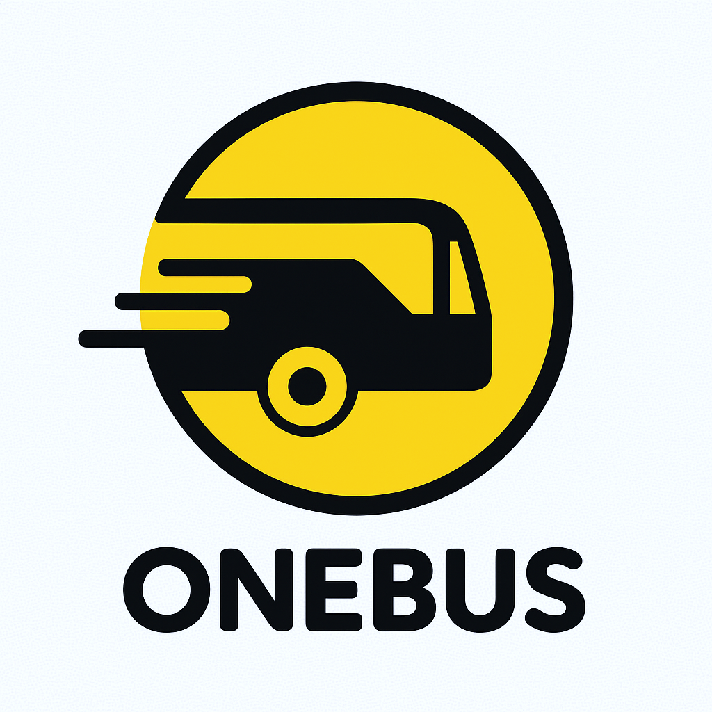
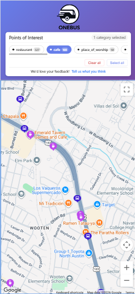

<!-- Improved compatibility of back to top link: See: https://github.com/othneildrew/Best-README-Template/pull/73 -->
<a id="readme-top"></a>

[![Contributors][contributors-shield]][contributors-url]
[![Forks][forks-shield]][forks-url]
[![Stargazers][stars-shield]][stars-url]
[![Issues][issues-shield]][issues-url]
[![project_license][license-shield]][license-url]

<br />
<div align="center">
  <a href="https://github.com/mmaliu97/OneBus-OA">
    
  </a>

<h3 align="center">OneBus</h3>

  <p align="center">
    Discover interesting places you can reach with just one bus ride.
    <br />
    <a href="https://github.com/mmaliu97/OneBus-OA"><strong>Explore the docs »</strong></a>
    <br />
    <br />
    <a href="https://onebusaustin.com">Live Site</a>
    &middot;
    <a href="https://github.com/mmaliu97/OneBus-OA/issues/new?labels=bug&template=bug-report---.md">Report Bug</a>
    &middot;
    <a href="https://github.com/mmaliu97/OneBus-OA/issues/new?labels=enhancement&template=feature-request---.md">Request Feature</a>
  </p>
</div>

---

<!-- TABLE OF CONTENTS -->
<details>
  <summary>Table of Contents</summary>
  <ol>
    <li><a href="#about-the-project">About The Project</a></li>
    <li><a href="#how-it-works">How It Works</a></li>
    <li>
      <a href="#architecture">Architecture</a>
      <ul>
        <li><a href="#data">Data</a></li>
        <li><a href="#backend">Backend</a></li>
        <li><a href="#frontend">Frontend</a></li>
      </ul>
    </li>
    <li><a href="#built-with">Built With</a></li>
    <li>
      <a href="#getting-started">Getting Started</a>
      <ul>
        <li><a href="#prerequisites">Prerequisites</a></li>
        <li><a href="#installation">Installation</a></li>
      </ul>
    </li>
    <li><a href="#usage">Usage</a></li>
    <li><a href="#roadmap">Roadmap</a></li>
    <li><a href="#contributing">Contributing</a></li>
    <li><a href="#license">License</a></li>
    <li><a href="#contact">Contact</a></li>
    <li><a href="#acknowledgments">Acknowledgments</a></li>
  </ol>
</details>

---

<!-- ABOUT THE PROJECT -->
## About The Project

OneBus is a web app designed to encourage people in Austin, TX to use public transit by showing them all the interesting places they can reach with just a single bus ride. Instead of wondering where the bus can take you, OneBus makes it visual — share your location, and instantly see restaurants, cafes, places of worship, and more that are just one bus away.

Check it out live at **[onebusaustin.com](https://onebusaustin.com)**



<p align="right">(<a href="#readme-top">back to top</a>)</p>

---

<!-- HOW IT WORKS -->
## How It Works

1. **You share your location.** OneBus grabs your current latitude and longitude.
2. **Nearby bus stops are found.** The app queries for the bus stops closest to you.
3. **Reachable stops are calculated.** Based on the bus lines available at those nearby stops, OneBus finds every other stop you can reach in one ride.
4. **Points of interest are surfaced.** The app queries for POIs near all those reachable stops and returns them grouped by category (restaurants, cafes, places of worship, and more).
5. **You explore.** Results are shown on an interactive map with filters so you can focus on what matters to you.

<p align="right">(<a href="#readme-top">back to top</a>)</p>

---

<!-- ARCHITECTURE -->
## Architecture

### Data

Bus stop and route data comes from **CapMetro's GTFS feed** (General Transit Feed Specification). This data is cleaned and processed to produce a table of all unique bus stops in Austin, each tagged with the bus lines that serve it.

Points of interest are queried using **OSMnx**, a Python package that pulls POI data from OpenStreetMap. Future iterations will supplement this with additional data scraped from Yellow Pages via Selenium.

### Backend

The backend is a Django REST API with a single primary endpoint that accepts a user's latitude and longitude and returns:
- All bus stops reachable from the user's location in one ride
- Points of interest near those stops, grouped by category

The API is hosted as an **AWS Lambda function**. When a user loads the site, a request is sent to Lambda, which spins up the necessary database tables and runs the Python logic to go from user coordinates to a full list of reachable POIs and bus stops.

### Frontend

The frontend is built in **React** and displays results on an interactive Google Map. Bus stops are shown as dark purple markers and points of interest as light purple markers. Users can filter results by POI category (restaurants, cafes, places of worship, etc.) to narrow down what they want to explore.

The UI was designed in **Figma**.

<p align="right">(<a href="#readme-top">back to top</a>)</p>

---

<!-- BUILT WITH -->
## Built With

- [Django](https://www.djangoproject.com/)
- [React](https://reactjs.org/)
- [Python](https://www.python.org/) + [OSMnx](https://osmnx.readthedocs.io/)
- [AWS Lambda](https://aws.amazon.com/lambda/)
- [CapMetro GTFS](https://www.capmetro.org/planner)
- [OpenStreetMap](https://www.openstreetmap.org/)
- [Figma](https://www.figma.com/)

<p align="right">(<a href="#readme-top">back to top</a>)</p>

---

<!-- GETTING STARTED -->
## Getting Started

### Prerequisites

You'll need [Python 3](https://www.python.org/downloads/) installed.

### Installation

1. Clone the repo
   ```sh
   git clone https://github.com/mmaliu97/OneBus-OA.git
   ```
2. Install packages
   ```sh
   pip install -r .\requirements.txt
   ```
3. Run the server
   ```sh
   python .\manage.py runserver --noreload
   ```

<p align="right">(<a href="#readme-top">back to top</a>)</p>

---

<!-- USAGE -->
## Usage

Sample API request (running locally):

```
POST http://127.0.0.1:8000/api/
{
  "latitude": "30.31431458225797",
  "longitude": "-97.73587186057428123"
}
```

<p align="right">(<a href="#readme-top">back to top</a>)</p>

---

<!-- ROADMAP -->
## Roadmap

- [ ] Yellow Pages scraper via Selenium for expanded POI data
- [ ] Expanded POI categories
- [ ] Support for additional cities beyond Austin

See the [open issues](https://github.com/mmaliu97/OneBus-OA/issues) for a full list of proposed features and known issues.

<p align="right">(<a href="#readme-top">back to top</a>)</p>

---

<!-- CONTRIBUTING -->
## Contributing

Contributions are what make the open source community such an amazing place to learn, inspire, and create. Any contributions you make are **greatly appreciated**.

If you have a suggestion that would improve this project, please fork the repo and create a pull request. You can also open an issue with the tag "enhancement". Don't forget to give the project a star!

1. Fork the project
2. Create your feature branch (`git checkout -b feature/AmazingFeature`)
3. Commit your changes (`git commit -m 'Add some AmazingFeature'`)
4. Push to the branch (`git push origin feature/AmazingFeature`)
5. Open a pull request

<p align="right">(<a href="#readme-top">back to top</a>)</p>

---

<!-- LICENSE -->
## License

Distributed under the project license. See `LICENSE.txt` for more information.

<p align="right">(<a href="#readme-top">back to top</a>)</p>

---

<!-- CONTACT -->
## Contact

Your Name - [@twitter_handle](https://twitter.com/twitter_handle) - email@email_client.com

Project Link: [https://github.com/mmaliu97/OneBus-OA](https://github.com/mmaliu97/OneBus-OA)

<p align="right">(<a href="#readme-top">back to top</a>)</p>

---

<!-- ACKNOWLEDGMENTS -->
## Acknowledgments

* []()
* []()
* []()

<p align="right">(<a href="#readme-top">back to top</a>)</p>

---

<!-- MARKDOWN LINKS & IMAGES -->
[contributors-shield]: https://img.shields.io/github/contributors/mmaliu97/OneBus-OA.svg?style=for-the-badge
[contributors-url]: https://github.com/mmaliu97/OneBus-OA/graphs/contributors
[forks-shield]: https://img.shields.io/github/forks/mmaliu97/OneBus-OA.svg?style=for-the-badge
[forks-url]: https://github.com/mmaliu97/OneBus-OA/network/members
[stars-shield]: https://img.shields.io/github/stars/mmaliu97/OneBus-OA.svg?style=for-the-badge
[stars-url]: https://github.com/mmaliu97/OneBus-OA/stargazers
[issues-shield]: https://img.shields.io/github/issues/mmaliu97/OneBus-OA.svg?style=for-the-badge
[issues-url]: https://github.com/mmaliu97/OneBus-OA/issues
[license-shield]: https://img.shields.io/github/license/mmaliu97/OneBus-OA.svg?style=for-the-badge
[license-url]: https://github.com/mmaliu97/OneBus-OA/blob/master/LICENSE.txt